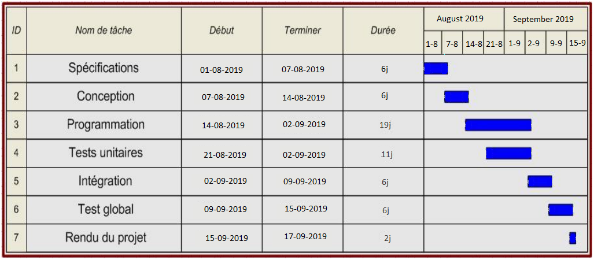

# Sommaire
##  Introduction..............................................................................................................................
##  Description du projet............................................................................................................
- #### I.Objectifs du projet
- #### II.Points Forts
- #### III.Points Faibles
- #### IV.Fonctionnalités ciblées

##  Objectifs quantitatifs.............................................................................................................

## Déroulement du projet........................................................................................................

- #### I.Planification
- #### II.Spécifications
- #### III.Conception
- #### IV.Programmation
- #### V.Tests unitaires
- #### VI.Intégration
- #### VII.Test global

##  Spécification..........................................................................................................................

- #### I. Spécifications fonctionnelles .........................................................................................................................................................

- #### II. Spécifications technique.................................................................................................................................................................

   .1. Technologies utilisées 
  
  
   .2. Configurations de machines
   
   
   .3. Architecture technique de produit
   
   
   .4. les librairies utilisées
   
## Ressources

- #### Ressources humaines

- #### Équipements

## Le fonctionnement du système
- #### Capteur et données
- #### Capteurs de poids
- #### Transmission de données des capteurs 
- #### Achat
- #### Entrez, payez, puis laissez

## Diagrammes et documents

#### Diagramme de base de données (MLD)
------------

------------

#  Introduction
Dans le cadre de l’unité d’enseignement "Projet" du matière Architectures Logicielles Java (C2) à l’université ISAE Cnam, il nous ait demandé de travailler sur un projet de développement de système d’information de notre choix.
Après discussion entre les membres de l’équipe chargée de la mise en œuvre du projet, nous avons décidé de créer un système spécial pour les magasins "Go Store".

"Go Store" est un système de magasin de haute technologie de style "Amazon Go". Ce système fournit un magasin qui n’a pas besoin de caissier ni de caisse enregistreuse. Entrez dans le magasin, prenez les choses et allez

Ce document décrit le contexte, les besoins fonctionnels et les objectifs du projet. Un premier découpage des étapes nécessaires à la réalisation d’un tel projet donne lieu dans de document à un planning prévisionnel. Ce document a pour finalités de définir le projet de manière simple et détaillée et de définir les objectifs auxquels devra répondre une future spécification technique.

#  Description du projet

## I. Objectifs du projet
L'objectif principal du projet est d'améliorer la gestion des ventes et des achats en magasin et de transformer le processus de vente et de facturation en un processus automatique.
Au départ, il s’agit d’identifier clairement les besoins et les attentes
Un système d'information permettant la gestion des échanges.

"Go store" est une infrastructure de magasinage modulaire qui offre aux clients une expérience de magasinage sans friction. Inspirée par les innovations récentes révélées par Amazon Go, notre équipe souhaitait ambitieusement recréer la même expérience - avec un budget étudiant.

L'idée commence par un système dans lequel les personnes s'inscriront dans notre base de données en fournissant leur nom et leur photo une seule fois. Les clients peuvent ensuite accéder à notre magasin en lisant simplement le code via l'application qui se trouvera sur leur téléphone à notre entrée. Ils pourront également prendre un article et l'ajouter automatiquement à leur panier. Les éléments sont découverts comme capturés en plaçant des capteurs de lumière et à ultrasons sous leurs étagères respectives.

Les gestionnaires peuvent également suivre les clients dans leurs magasins en temps réel via notre application de gestion en déterminant quels clients sont en magasin et ce qu'ils ont dans leur panier.

Les clients peuvent visualiser leur panier en temps réel sur leur téléphone avec notre application , puis sortir devant notre caméra de sortie et être informés de leur facture sur leur téléphone. Tout cela sans interaction humaine et mieux encore, sans temps d'attente.

Tout au long du projet, la notion de passage à l’échelle devra être prise en compte. L’objectif à long terme de la conception et du développement d’un tel système d’information est de pouvoir être utilisé par toutes les catégories et magasins.

## II. Points Forts

- Pas d'attente dans les lignes.
- Pas de caissiers.
- Pas de caisse.
- Pas de glisser votre carte.
- Gain de temps (le temps compte).
- Le client peut porter ses bagages à l'intérieur le magasin.
- Le vol à l'étalage est littéralement impossible

## III Points Faibles

- Le client devrait avoir l'application .
- Le client devrait avoir un compte.
- Le client a besoin d’Internet pour entrer dans le magasin.

## IV. Fonctionnalités ciblées

Les fonctionnalités attendues de l'application sont les suivantes :
- Ajoutter , Mettre à jour, et effacer un produit.
- Inscrire, Mettre à jour , et effacer un client.
- Permettre au client d'entrer au magasin après la verification d'identite a partir une application sur leur telephone.
- Détection du produit pris.
- Detecter le client qui a pris le produit.
- Ajouter le produit en temps réel au shopping cart.
- Supprimer le produit en temps réel du shopping cart si le produit a été ramené.
- Permettre au client de voir les  produits sélectionnés en temps reel, leurs prix et la facture totale via l'application.
- Vérifiez si le compte client a assez d'argent pour ouvrir la porte au moment du départ.
-La facture totale est automatiquement déduite du compte lorsque le client quitte et envoie un message l'informant du montant retiréز
-Permettre au gérant de magasin de voir les clients qui sont dans le magasin et les produits qu'ils ont choisis.
- Permettre au gérant de magasin de voir les rapports de vente.

# Objectifs quantitatifs

Ce projet qui sera appliqué est en principe un projet universitaire et l’objectif est d’appliquer les acquis de l’enseignement scolaire. Il peut ensuite être étendu, consulté et appliqué dans les magasins pour faciliter les achats et faciliter ainsi la vie des gens.

# Contraintes du projet

### I. Contraintes en termes de délais
A partir de la livraison du cahier des charges, nous disposons d’environ un mois et demis pour la réalisation du projet. Le délai semble court pour le projet entier dédié à la gestion des processus d'un magasin complet ,mais reste suffisant pour se concentrer sur la partie prévue pour l'idee.

### II. Contraintes de sécurité
La gestion de la sécurité est la principale contrainte de notre système. L'application doit posséder une gestion de privilèges et de niveaux d'accès pour les différents types d'utilisateurs (Clients,administration,..). Selon leur statut, le contenu des pages varie et l'accès aux informations avec un statut
supérieur est interdit.

### III. Contraintes technique
 La structure de notre système doit être extensible pour
la mettre en place facilement dans les magasins. De plus, le développement devra
suivre toutes les normes techniques pour une meilleure performance, maintenance et facilité de mise à jour.

# Déroulement du projet

## I. Planification

Une première analyse du projet nous à permis de définir une suite d’étapes à suivre pour sa réalisation.

- #### Spécifications
Durant cette étape, nous allons définir clairement ce qui doit être réalisé pour atteindre chaque objectif du projet.

- #### Conception
Cette phase permettra de faire le choix entre les différentes solutions techniques en respectant les contraintes du projet.

- #### Programmation
Écriture du code des différents modules et leurs fonctionnalités.

- #### Tests unitaires
Cette étape se chevauche avec l'étape de programmation, les tests unitaires devront être effectues pendant le développement pour s'assurer du bon fonctionnement du chaque module du l'application.

- #### Intégration
Regroupement de l'ensemble des modules après leur validation par chaque développeur des composants qu'il a réalisé.

- #### Test global
Cette partie permet de s'assurer que toutes les fonctionnalités de l'application sont valides, après l'intégration.
Le diagramme ci-dessous illustre pour chaque étape du déroulement du projet, les dates de début et de fin ainsi que la durée.

# Spécifications

## I. Spécifications fonctionnelles

L'utilisateur devra simplement télécharger l'application et créer un profil. Le profil contient le nom complet, la photo du visage de l'utilisateur, les informations de la carte de paiement, son numéro de téléphone et son adresse s'il le souhaite. 
Une fois le profil créé, l'utilisateur peut accéder au magasin en scannant le QR code. Il peut ensuite effectuer l'achat et prendre les produits qu'il souhaite, puis quitter le magasin sans s'arrêter devant le fonds de comptabilité ou compter la valeur des produits qu'il a pris. 
Au moment du départ, il est seulement nécessaire de refaire le scan du QR code pour pouvoir sortir.

## II. Spécifications technique

### 1.Technologies utilisées

Dans ce project en doit utiliser Java comme language du developement des services, on doit créer des sevices indepedants using spring boot qui peut être applées par restfull APIs. On a choisir Java a cause de sa capacité à passer facilement d'un système informatique à un autre, la possibilité d'exécuter le même programme sur de nombreux systèmes différents est cruciale, et Java y parvient en étant indépendant de la plate-forme.
En raison de la robustesse, de la facilité d'utilisation, des capacités multi-plateformes et des fonctionnalités de sécurité de Java, la décision est prise.

D'autre part pour le raspberry pi, senors et automation on doit ustiliser Python. Parce que Python est la language utiliser par defaut in rusbery pi ,et en plus, Python est un langage polyvalent, multiplateforme et open source.

Enfin, pour l'application mobile en doit créer cross-platform mobile app ,
pour reduire le temps du developement de deux mobile app ios/android , en plus cross platform utilise javascript ce qui donne la facile à intégrer avec d'autres services et fournisseurs et encore il est universal.

### 2.Configurations de machines

### 3.Architecture technique de produit

### 4.Les librairies utilisées

## II. Ressources
Pour finir, nous allons décrire l'ensemble des ressources mises a disposition pour la réalisation du projet.

#### Ressources humaines
Le projet sera réalisé par un groupe de trois étudiants. Il est nécessaire d'évaluer la charge de travail que chaque membre sera en mesure de fournir, notamment pour les tâches qui nécessitent une répartition : programmation et tests unitaires. On estime la charge de travail personnel qui devra être
consacrée à la conception, au développement et aux tests unitaires à environ 120 heures pour chaque membre du groupe.

#### Équipements

Pour que nous puissions créer cette idée et l'appliquer correctement, nous avons besoin d'un ensemble d'équipements:

- Raspberry Pi
- Bread Board
- Cables de connections
- Proximity sensor
- Camera sensor

## Le fonctionnement du système

#### Capteur et données

Notre objectif était de fournir la même expérience qu’Amazon Go. Pour ce faire, les capteurs et la collecte de données étaient essentiels, mais de nombreux capteurs différents auraient pu être choisis pour les besoins. Initialement, nous avons collecté des images statiques à l'aide d'une caméra et analysé les données téléchargées. Au final cependant, nous avons choisi les deux suivants:
- Capteur images (Camera)
- capteur de distance (Proximity sensors)

#### Capteur images
Un capteur image reconnaît le visage d'un personne. Il suit les clients dans le magasin et détecte le mouvement des clients qui tendent leur main vers les produits .

Ici, un capteur , y compris le réseau local, ont été configurés et l'application qui analyse les données du capteur est déjà en cours d'exécution. Les données de capteur suivent les clients et envoient l'événement IoT via APO, à chaque fois qu'ils entrent dans le magasin et chaque fois qu'ils cherchent les produits. Ceci déclenche alors une fonction.

#### Capteurs de distanse
Pour les capteurs de distanse, appelée Proximity sensor, est fixée à l’arrière de chaque conteneur, où les produits sont stockés. Il envoie périodiquement la distance des conteneurs. Du côté Back-end, les données de base des produits (par exemple, le mesure moyen du produit A est de 7 cm) sont gérées. Par conséquent, le système peut finalement indiquer qu'un client a acheté l'un des en-cas A si le mesure de son conteneur a diminué de 7 cm, ou deux en-cas A si le poids a diminué de 14 cm. Néanmoins, ce n’était pas une logique si simple. C'était en fait assez complexe en raison de nombreux éléments variables. Par exemple, les données du capteur n'étaient pas toujours précises, ou le timing exact (horodatage) pourrait être légèrement différent.

#### Transmission de données des capteurs 
Il existe un méthode principale pour transmettre les données des capteurs, qui est HTTP (s).

 Il serait bon de configurer une passerelle API avant un service, puis d'enregistrer les données dans MYSQL.

Dans nos scénarios, les capteurs de distance transfèrent les données via HTTP qui sont traitées dans Cloud, API Gateway, service et MySQL. L'énorme quantité de données accumulées dans MySQL sera automatiquement supprimée dans quelques jours avec le réglage de la durée de vie.

#### Achat
Dans un magasin sans caisse, le système doit reconnaître qui a acheté quels produits et combien. Les données d'entrée pour l'accusé de réception sont collectées par les capteurs, mais ces données, comme mentionné ci-dessus, ne sont pas toujours précises. Le système doit donc les reconnaître de manière exhaustive en utilisant plusieurs données de capteur.

Dans cette version, nous n’avons implémenté que deux types de capteurs. Le capteur de distance envoie un événement d'achat à un service a traver un API lors de la détection du changement de la distance du conteneur. L'événement d'achat sera mis en correspondance par un service avec les informations du deuxième type de capteur - capteur d'image qui detecte quel client a effectuer l'achat.

Une des clés pour le traitement des données de capteurs multiples réside dans leurs horodatages. Cependant, ils ne correspondent généralement pas parfaitement, aussi une différence de quelques secondes devrait être autorisée. Par exemple, lorsque l'horodatage d'un événement d'achat est à 14:20:50, le capteur de d'image le détecte à 14:20:51. Dans notre système, les événements de quelques secondes de différence sont reconnus comme des événements simultanés.

#### Entrez, payez, puis laissez

Les clients entrent dans le magasin en utilisant un code QR dans une application mobile. Lors de leur enregistrement, ils sont authentifiés via un service et l'API sera déclenchée, tout comme les applications mobiles normales.

Ce qui est unique pour ce magasin sans caissier, c'est que l'authentification est associée aux données de suivi collectées par les capteurs images. Dans le magasin, les capteurs images suivent les clients. Par conséquent, les données elles-mêmes ne peuvent pas dire qui a acheté les produits, lesquels ont été pris. Pour identifier le client, un capteur distance envoie un événement lorsqu'un client prend un produit. Il est associé aux informations d'enregistrement envoyées via l'application mobile.

Des processus similaires se produisent lorsqu'un client quitte le magasin. Lorsqu'un client Scan QR code pour sortira du zone de stockage, un événement de sortie est envoyé à une service. le service met en correspondance les informations d'enregistrement et le système peut évaluer que le client s'est arrêté avec succès et encore verifier si le client peut sortir ou non par rapport a ses informations de payment .

Lorsque vous quittez le magasin, vous recevez un rapport de paiement dans l'application mobile.

## Diagrammes et documents

####  Diagramme de base de données (MLD)

![MLD](images/mld.jpg "Mafin de
